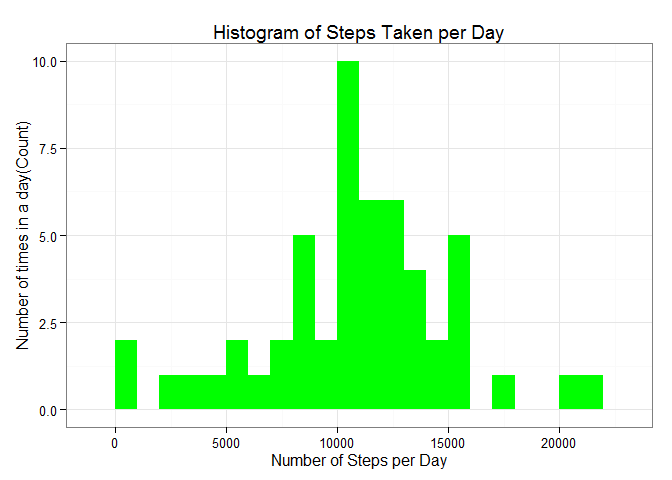
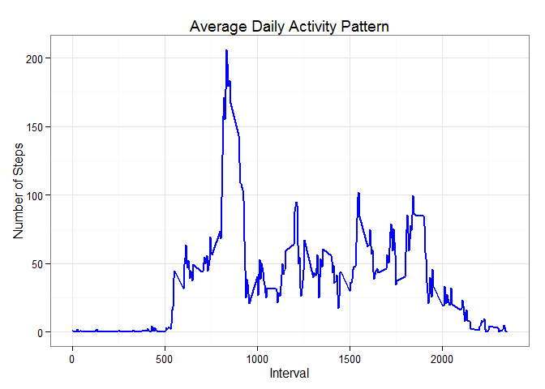
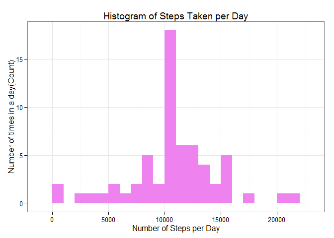
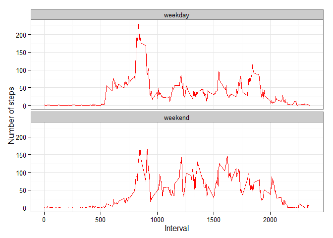

# Reproducible Research: Peer assessment 1
### *Linda Bruwer*
### *2015-05-08*
###### Github repository with RMarkdown source code:
[RepData_PeerAssessment1](https://github.com/LBruwer/RepData_PeerAssessment1)
==============================================================

## Introduction

This document produce the Peer Assessed Assignment 01 for the course [Reproducible Research](https://class.coursera.org/repdata-014) on [coursera](https://www.coursera.org). This assignment makes use of data from a personal activity tracking device. This device collects data at 5 minute intervals throughout the day. The data contains two months worth of data from an anonymous individual.  The data was collected during the months of October and November 2012.

**A single R markdown document** is produced through use of **knitr** which is transformed into a HTML file.  

Weekday activities follow a routine that can be described as work related.  Increased activity intensity is observed outside of working hours. 

An important consideration is the fact of our data presents as a t-student distribution (see both histograms), it means that the impact of inputing missing values with the mean has a significant impact prediction without a significant distortion in the distribution of the data.  

## Preparation of the R environment

**echo = TRUE** is used ensuring the code can be read. 

First, we set echo equal to **TRUE** and results equal to **'hold'** as global options for this document.


```r
library(knitr)
```

```
## Warning: package 'knitr' was built under R version 3.1.3
```

```r
opts_chunk$set(echo = TRUE, results = 'hold')
```

### Loading required libraries

```r
library(data.table)
```

```
## Warning: package 'data.table' was built under R version 3.1.3
```

```r
library(ggplot2) # we shall use ggplot2 for plotting figures
```

```
## Warning: package 'ggplot2' was built under R version 3.1.3
```


## Loading and preprocessing data

This assignment makes use of data from a personal activity tracking device. This device collects data at 5 minute intervals through out the day. The data consists of two months of data from an anonymous individual collected during the months of October and November, 2012 and include the number of steps taken in 5 minute intervals each day.  

This assignment instructions request to show any code that is needed to loading and preprocessing the data, like to:  

1. Load the data (i.e. > <font color='red'>read.csv()</font>)  
2. Process/transform the data (if necessary) into a format suitable for your analysis

### Load the required data

The following statement is used to load the data using `read.csv()`.

**Note**: It is assumed that the file activity.zip is in the current working directory. File can be downloaded from [here](https://d396qusza40orc.cloudfront.net/repdata%2Fdata%2Factivity.zip)
This file is unzipped in same directory, giving activity.csv


```r
unzip("activity.zip")

rdata <- read.csv('activity.csv', header = TRUE, sep = ",",
                  colClasses=c("numeric", "character", "numeric"))
```

### tidy the data or preprocess the data

We convert the **date** field to `Date` class and **interval** field to `Factor` class.


```r
rdata$date <- as.Date(rdata$date, format = "%Y-%m-%d")
rdata$interval <- as.factor(rdata$interval)
```

Now, let us check the data using `str()` method:


```r
str(rdata)
```

```
## 'data.frame':	17568 obs. of  3 variables:
##  $ steps   : num  NA NA NA NA NA NA NA NA NA NA ...
##  $ date    : Date, format: "2012-10-01" "2012-10-01" ...
##  $ interval: Factor w/ 288 levels "0","5","10","15",..: 1 2 3 4 5 6 7 8 9 10 ...
```

## What is mean total number of steps taken per day?

Now here we ignore the missing values(*a valid assumption*).

We proceed by calculating the total steps per day.


```r
steps_per_day <- aggregate(steps ~ date, rdata, sum)
colnames(steps_per_day) <- c("date","steps")
head(steps_per_day)
```

```
##         date steps
## 1 2012-10-02   126
## 2 2012-10-03 11352
## 3 2012-10-04 12116
## 4 2012-10-05 13294
## 5 2012-10-06 15420
## 6 2012-10-07 11015
```

1. Now we make a histogram of the total number of steps taken per day, plotted with appropriate bin interval.


```r
ggplot(steps_per_day, aes(x = steps)) + 
       geom_histogram(fill = "green", binwidth = 1000) + 
        labs(title="Histogram of Steps Taken per Day", 
             x = "Number of Steps per Day", y = "Number of times in a day(Count)") + theme_bw() 
```

 

2. Now we calculate the ***mean*** and ***median*** of the number of steps taken per day.


```r
steps_mean   <- mean(steps_per_day$steps, na.rm=TRUE)
steps_median <- median(steps_per_day$steps, na.rm=TRUE)
```

The mean is **10766.189** and median is **10765**.

## What is the average daily activity pattern?

We calculate the aggregation of steps by intervals of 5-minutes and convert the intervals as integers and save them in a data frame called `steps_per_interval`.


```r
steps_per_interval <- aggregate(rdata$steps, 
                                by = list(interval = rdata$interval),
                                FUN=mean, na.rm=TRUE)
#convert to integers
##this assists with plot
steps_per_interval$interval <- 
        as.integer(levels(steps_per_interval$interval)[steps_per_interval$interval])
colnames(steps_per_interval) <- c("interval", "steps")
```


1. The plot is completed the time series of the average number of steps taken (averaged across all days) vs. the 5-minute intervals:


```r
ggplot(steps_per_interval, aes(x=interval, y=steps)) +   
        geom_line(color="blue", size=1) +  
        labs(title="Average Daily Activity Pattern", x="Interval", y="Number of Steps") +  
        theme_bw()
```

 


2. Now, we find the 5-minute interval with the containing the maximum number of steps:


```r
max_interval <- steps_per_interval[which.max(  
        steps_per_interval$steps),]
```

The **835<sup>th</sup>** interval has maximum **206** steps.


## Input missing values:

### 1. Total number of missing values:

The total number of missing values in steps can be calculated using `is.na()` method to check whether the value is mising or not and then summing the logical vector.


```r
missing_vals <- sum(is.na(rdata$steps))
```

The total number of ***missing values*** are **2304**.

### 2. Strategy for filling in all of the missing values in the dataset

Missing valuesare populated with the mean value from the same interval (across days). Usually, the  median is a better centrality measure compared to the mean.  In this case the total median is not very far away from total mean.

A function `na_fill(data, pervalue)` with `data` arguement the `rdata` data frame and `pervalue` arguement the `steps_per_interval` data frame.


```r
na_fill <- function(data, pervalue) {
        na_index <- which(is.na(data$steps))
        na_replace <- unlist(lapply(na_index, FUN=function(idx){
                interval = data[idx,]$interval
                pervalue[pervalue$interval == interval,]$steps
        }))
        fill_steps <- data$steps
        fill_steps[na_index] <- na_replace
        fill_steps
}

rdata_fill <- data.frame(  
        steps = na_fill(rdata, steps_per_interval),  
        date = rdata$date,  
        interval = rdata$interval)
str(rdata_fill)
```

```
## 'data.frame':	17568 obs. of  3 variables:
##  $ steps   : num  1.717 0.3396 0.1321 0.1509 0.0755 ...
##  $ date    : Date, format: "2012-10-01" "2012-10-01" ...
##  $ interval: Factor w/ 288 levels "0","5","10","15",..: 1 2 3 4 5 6 7 8 9 10 ...
```

Check for remaining missing values


```r
sum(is.na(rdata_fill$steps))
```

```
## [1] 0
```

Zero output shows that there are ***NO MISSING VALUES***.


### 3. A histogram of the total number of steps taken each day

A histogram plot of daily total number of steps taken, with a bin magnitude of 1000 steps (after populating missing values).


```r
fill_steps_per_day <- aggregate(steps ~ date, rdata_fill, sum)
colnames(fill_steps_per_day) <- c("date","steps")

## plot the histogram
ggplot(fill_steps_per_day, aes(x = steps)) + 
       geom_histogram(fill = "violet", binwidth = 1000) + 
        labs(title="Histogram of Steps Taken per Day", 
             x = "Number of Steps per Day", y = "Number of times in a day(Count)") + theme_bw() 
```

 

### Calculate and report the **mean** and **median** total number of steps taken per day.


```r
steps_mean_fill   <- mean(fill_steps_per_day$steps, na.rm=TRUE)
steps_median_fill <- median(fill_steps_per_day$steps, na.rm=TRUE)
```

The mean is **10766.189** and median is **10766.189**.

### Do these values differ from the estimates from the first part of the assignment?

The values do differ slightly.

- **Before filling the data**
    1. Mean  : **10766.189**
    2. Median: **10765**
    
    
- **After filling the data**
    1. Mean  : **10766.189**
    2. Median: **10766.189**

The values (after filling the data) for mean and median are equal.

### What is the impact of imputing missing data on the estimates of the total daily number of steps?

Comparing to the calculations done in the first section of this document, we observe that while the mean value remains unchanged, the median value has shifted and virtually matches the mean.  

Since our data set has shown a t-student distribution (see both histograms), it seems that the impact of inputing missing values has increased our peak, but it has not affected the predictations negatively. 


## Are there differences in activity patterns between weekdays and weekends?

This comparison is done with the table with amended missing values.  
1. Augment the table with a column noting the weekday  
2. Subset the table into two parts - weekends (Saturday and Sunday) and weekdays (Monday through Friday).  
3. Tabulate the average steps per interval for each data set.  
4. Plot the two data sets side by side enabling easy comparison.  


```r
weekdays_steps <- function(data) {
    weekdays_steps <- aggregate(data$steps, by=list(interval = data$interval),
                          FUN=mean, na.rm=T)
    # convert to integers for plotting
    weekdays_steps$interval <- 
            as.integer(levels(weekdays_steps$interval)[weekdays_steps$interval])
    colnames(weekdays_steps) <- c("interval", "steps")
    weekdays_steps
}

data_by_weekdays <- function(data) {
    data$weekday <- 
            as.factor(weekdays(data$date)) # weekdays
    weekend_data <- subset(data, weekday %in% c("Saturday","Sunday"))
    weekday_data <- subset(data, !weekday %in% c("Saturday","Sunday"))
    
    weekend_steps <- weekdays_steps(weekend_data)
    weekday_steps <- weekdays_steps(weekday_data)
    
    weekend_steps$dayofweek <- rep("weekend", nrow(weekend_steps))
    weekday_steps$dayofweek <- rep("weekday", nrow(weekday_steps))
    
    data_by_weekdays <- rbind(weekend_steps, weekday_steps)
    data_by_weekdays$dayofweek <- as.factor(data_by_weekdays$dayofweek)
    data_by_weekdays
}

data_weekdays <- data_by_weekdays(rdata_fill)
```

The panel-plot comparison of the average number of steps taken per 5-minute interval across weekdays and weekends:

```r
ggplot(data_weekdays, aes(x=interval, y=steps)) + 
        geom_line(color="red") + 
        facet_wrap(~ dayofweek, nrow=2, ncol=1) +
        labs(x="Interval", y="Number of steps") +
        theme_bw()
```

 

It is clear from the top graph that activity during the week has highest peak of all step intervals. Weekend activities have more peaks exceeding a hundred compared to midweek. This could be due to the fact that activities on weekdays mostly follow a work related routine.  Weekend activity may include leasure or sport with higher activity intensity.
